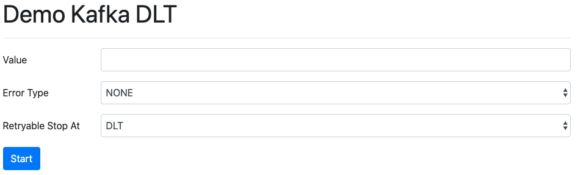

# Demo Kafka DLT

## Create topics

* main-topic
* main-topic-retry-1
* main-topic-retry-2
* main-topic-retry-3
* main-topic-dlt

````
kafka-topics --bootstrap-server localhost:9092 --create --topic main-topic --replication-factor 1 --partitions 1
````

## Start simulation

Access http://localhost:8080 fill out the form and press start



## Check kafka topics

Using terminal, create kafka-console-consumer on topics to see the magic happening based in what you choose as _error type_ 
and _retryable stop_ at options.